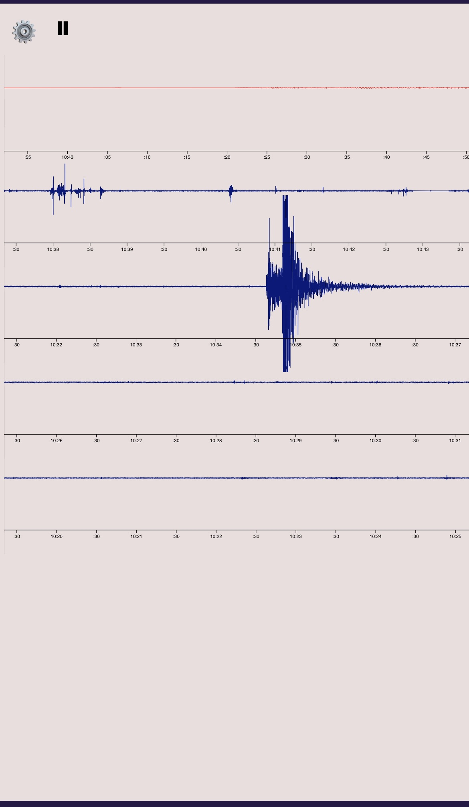
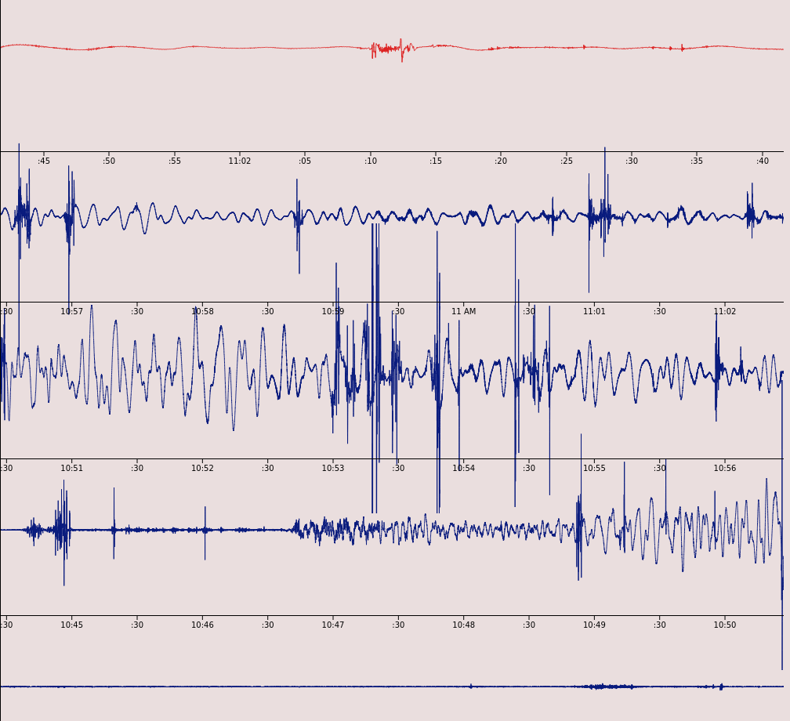
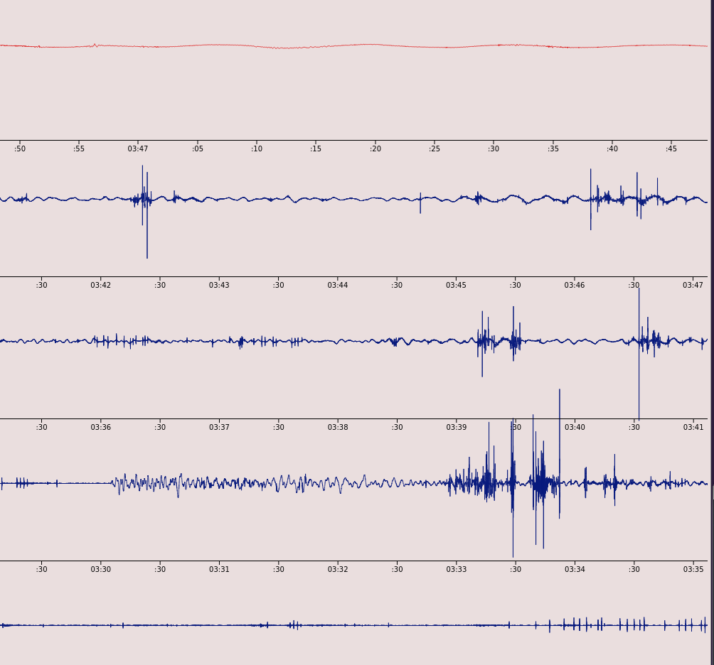

# ShakeStream

Local live streaming graph for the Raspberry Shake 4D  
Select any of the four sensors  
Light or dark mode  

### Requires a server that can do these things:
- Run seismo.py
		Receives the shake's UDP data
		Serves the processed shake data to a browser over websocket
- Run a basic webserver
		Serve shake.html and d3.v7.min.js https://d3js.org/d3.v7.min.js

Five graph lines are displayed.  
The first line is a live stream with 60 seconds of data.  
Lines 2 - 5 each contain 6 minutes of data and are updated once per minute.  
The entire page contains 24 to 25 minutes of data at any time.  

**WARNING: DO NOT MAKE THIS AVAILABLE OVER THE INTERNET**
This is meant for private networks.  
Use a VPN if remote access is desired.  

Server side cpu and memory usage is light.  
Browser cpu usage is very high.  

## Background
When I got my Shake 4D, I was disappointed that the /heli graphs update only once a minute.  
I bought the shake hoping it would let me see a live seismograph.  
You can connect to the Shake Community and see somewhat live data, but it's still not 'right now' 
and not as cool as seeing the needle move on a realtime seismograph.  

The initial plan was to run this in Docker on the shake alongside the other containers it comes with.  
After opening access to docker.io, it failed to pull alpine.  
Next, I tried building the container on another server with a current version of Docker.  
The container failed to run on the shake with 'no subsystem for mount'.  
Both errors seem to be due to the version of Docker on the shake being too old.  
The shake runs Docker version 1.11.1.  

When setting up the Shake, I put it on a new VLAN with no internet access and saw it trying
to reach two IP addresses on port 53. This thing ignores dhcp and is trying to bypass a layer of network security.

grep -r "180.76.76.76" /usr/* 
/usr/local/src/UPG/UPG.20/files/bin/set-dns:		echo 'nameserver 180.76.76.76' | sudo sh -c "cat >> $RESOLVCFN"  
/usr/local/src/UPG/UPG.9/files/bin/rsh-data-config.sh:#	IPTESTS=( "8.8.8.8" "180.76.76.76" )  

Somebody's got some 'splaining to do. Those aren't malicious dns servers, but they're not mine.  
Sadness, outdated Docker and shady configurations, now I can't let it connect to the Shake Community and be able to sleep at night.  
For now it remains firewalled away, accessible only from inside my network and over VPN.

Fortunately, you can configure the shake to send data to another server.  
They do provide good documentation for that.  
https://manual.raspberryshake.org/udp.html  

This runs on a display on a wall in my office, and sometimes on my phone. Works fine over VPN on mobile data.  

This is somewhat abusive to the browser.  
I do recommend hitting the pause button before backgrounding a tab or you might have to close and reopen the browser.  
Firefox on an an old i5 uses 100% of one core, but doesn't cause the PC's fans to make any noise.  
I have seen the tab crash when the PC was busy doing other things.  
My phone gets warm and the battery use is noticeable if run for more than a few minutes.   

At first, I tried to have all lines live stream, but the browser couldn't handle it.  
Server side is light enough that it would run fine on the shake - probably.  

Database storage, time range selection, adjustable scale, and quake detection - maybe someday.  
Before doing any of that, I'd like to try plotly or echarts over d3 to see if any reduce browser cpu.  
One thing I should try is only send the data of the visible sensor instead of all the data all the time.  
Reducing resolution was just not appealing every time I considered it.  

ENE, ENZ, and ENN  sensors can drift completely off the scale.  
EHZ does not drift and it's the default.  
Based on some nearby 3's and 4's, I'm concerned that a larger quake will exceed the scale and be cut off.  
Figuring out a scale method that allows a reasonable range of view is a todo item.  
Logarithmic, auto adjust, manual adjust, dunno yet.  

One day I really should make time and reach out to the Shake folks and see if they can help with the issues.  

## How To
### Step 1	Configure the shake to send a UDP stream to your server.
    See https://manual.raspberryshake.org/udp.html

    Example
     /opt/settings/user/UDP-data-streams.conf
    {
        "UDP-destinations" : [
            { "dest" : "UDP-1"}
        ],
        "UDP-1" : {
            "Hostname" : "10.10.10.10",
            "Port" : "8889"
        }
    }
    
    If using a port other than 8889, edit this line in seismo.py to use the same port.  
    sock_rec.bind(('', 8889))</ul>

### Step 2 Get the python script running
    Choose a port for the websocket server  
    Edit seismo.py, replacing WEBSOCKETPORT with the port number  
    Optionally, replace 0.0.0.0 with the IP address of the websocket server  
    Also optionally set the UDP bind IP and port in seismo.py  
    &nbsp;&nbsp;sock_rec.bind(('IPADDRESS', 8889))  
    Run seismo.py manually or build and run the container  
    I realize I'm presuming the reader has knowledge of how to run this as a background process or build and run a container.  
    I'm running it in a rootless podman container</ul>

### Step 3 Setup the http server
    <ul>Prepare shake.html and download d3.js  
    Edit shake.html, setting the websocket server IP and port  
    Look for this line  
    var shakedat = new WebSocket("ws://WEBSOCKETIPADDRESS:WEBSOCKETPORT");  
    Replace WEBSOCKETIPADDRESS with your web server's name or ip.  
    Replace WEBSOCKETPORT with the same port that was set in seismo.py  
      
    Get a copy of d3.v7.min.js https://d3js.org/d3.v7.min.js  
    Set up an http server to serve shake.html and d3.v7.min.js from the same directory  
    Another option is to place the html and js file under /usr/src/fe in the rfe container on the shake</ul>

### Step 4 Enjoy
    <ul>Open a browser to http://[YourWebserver]/shake.html</ul>

# Screenshots
3.9 Ontario CA Sep 7 2024, about 50 miles away

7.0 Eureka CA Dec 5 2024, about 600 miles away

7.6 Caribbean Feb 8 2025, about 1500 miles away

